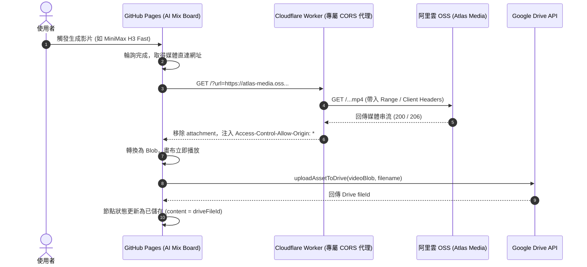

# Cloudflare Worker CORS 代理建置與影音自動轉存執行規範

本文件旨在解決 **AI Mix Board** 線上版本（GitHub Pages 純前端靜態環境）在接收外部 AI 服務（如 Atlas Cloud / 阿里雲 OSS）生成的影音時，因瀏覽器跨網域（CORS）與強制下載標頭（`Content-Disposition: attachment`）限制，導致**無法在畫布預覽**且**無法自動轉存至 Google Drive** 的問題。

---

## 1. 問題成因分析 (Root Cause Analysis)

| 關鍵因素 | 具體現象 | 對系統造成的影響 |
| :--- | :--- | :--- |
| **外部 OSS 限制** | 阿里雲 OSS 回傳 `x-oss-force-download: true` 與 `Content-Disposition: attachment`，且無 `Access-Control-Allow-Origin` 標頭。 | 瀏覽器原生 `<video src="...">` 解碼失敗，顯示「無法預覽影片」。 |
| **GitHub Pages 限制** | 純靜態網頁託管，沒有 Node.js 或後端服務器，無法使用本機 Vite 的 `/api/proxy-image` 端點。 | 請求本機代理直接回傳 404。 |
| **公開 Proxy 失效** | 第三方公開 CORS 代理（如 `corsproxy.io`）對大流量或多媒體請求回傳 403 阻擋，或頻繁逾時。 | 前端 `fetchImageBlob()` 返回 `null`，自動上傳至 Google Drive 的流程直接中斷。 |

---

## 2. 解決架構 (Solution Architecture)

透過部署輕量、免費且具高可用性的 **Cloudflare Worker** 作為專屬 CORS 串流代理：



---

## 3. Cloudflare Worker 實作規格 (Worker Specification)

### 3.1 核心需求
1. **跨域支援**：支援 `OPTIONS` Preflight，並對所有來源開放 `Access-Control-Allow-Origin: *`。
2. **串流與 Range 支援**：原樣轉發客戶端 `Range` 標頭並傳遞 `206 Partial Content`，讓長影片與播放軸拖曳順暢。
3. **標頭覆寫**：將 `Content-Disposition` 覆寫為 `inline`，並移除 `x-oss-force-download`。
4. **安全過濾（推薦）**：限制僅能代理影音與圖片相關的合法白名單網域，避免 Worker 遭濫用。

### 3.2 完整 Worker 程式碼 (`worker.js`)

```javascript
/**
 * AI Mix Board - Cloudflare Worker Media CORS Proxy
 * 支援串流、Range 斷點續傳、CORS 注入與強制下載標頭移除
 */

// 允許代理的網域白名單（可依需求擴充）
const ALLOWED_HOSTS = [
  'aliyuncs.com',
  'atlascloud.ai',
  'fal.media',
  'fal.run',
  'replicate.delivery',
  'openai.com',
  'google.com',
  'googleapis.com',
];

export default {
  async fetch(request, env, ctx) {
    const origin = request.headers.get('Origin') || '*';

    // 1. 處理 CORS 預檢請求 (OPTIONS)
    if (request.method === 'OPTIONS') {
      return new Response(null, {
        status: 204,
        headers: {
          'Access-Control-Allow-Origin': '*',
          'Access-Control-Allow-Methods': 'GET, HEAD, OPTIONS',
          'Access-Control-Allow-Headers': '*',
          'Access-Control-Max-Age': '86400',
        },
      });
    }

    // 僅允許 GET 與 HEAD
    if (request.method !== 'GET' && request.method !== 'HEAD') {
      return new Response(JSON.stringify({ error: 'Method not allowed' }), {
        status: 405,
        headers: { 'Content-Type': 'application/json', 'Access-Control-Allow-Origin': '*' },
      });
    }

    const requestUrl = new URL(request.url);
    const targetUrlStr = requestUrl.searchParams.get('url');

    if (!targetUrlStr) {
      return new Response(
        JSON.stringify({ error: 'Missing "url" query parameter. Example: /?url=https://...' }),
        {
          status: 400,
          headers: { 'Content-Type': 'application/json', 'Access-Control-Allow-Origin': '*' },
        }
      );
    }

    let targetUrl;
    try {
      targetUrl = new URL(targetUrlStr);
    } catch {
      return new Response(JSON.stringify({ error: 'Invalid URL format' }), {
        status: 400,
        headers: { 'Content-Type': 'application/json', 'Access-Control-Allow-Origin': '*' },
      });
    }

    // 安全檢查：檢查 host 是否符合白名單
    const isAllowed = ALLOWED_HOSTS.some(allowed => targetUrl.hostname.endsWith(allowed));
    if (!isAllowed) {
      return new Response(JSON.stringify({ error: 'Forbidden domain', host: targetUrl.hostname }), {
        status: 403,
        headers: { 'Content-Type': 'application/json', 'Access-Control-Allow-Origin': '*' },
      });
    }

    try {
      // 2. 轉發 Range 標頭以支援影音串流分段載入
      const forwardHeaders = new Headers();
      const rangeHeader = request.headers.get('Range');
      if (rangeHeader) {
        forwardHeaders.set('Range', rangeHeader);
      }
      forwardHeaders.set('User-Agent', 'Mozilla/5.0 (compatible; AIMixBoardProxy/1.0)');

      const upstreamRes = await fetch(targetUrl.toString(), {
        method: request.method,
        headers: forwardHeaders,
      });

      // 3. 構造乾淨的回應標頭
      const responseHeaders = new Headers(upstreamRes.headers);
      responseHeaders.set('Access-Control-Allow-Origin': '*');
      responseHeaders.set('Access-Control-Allow-Methods', 'GET, HEAD, OPTIONS');
      responseHeaders.set(
        'Access-Control-Expose-Headers',
        'Content-Range, Content-Length, Content-Type, Accept-Ranges'
      );

      // 強制瀏覽器直接呈現預覽（取消強制下載）
      responseHeaders.set('Content-Disposition', 'inline');
      responseHeaders.delete('x-oss-force-download');

      return new Response(upstreamRes.body, {
        status: upstreamRes.status,
        statusText: upstreamRes.statusText,
        headers: responseHeaders,
      });
    } catch (err) {
      return new Response(JSON.stringify({ error: 'Proxy fetch failed', message: err.message }), {
        status: 502,
        headers: { 'Content-Type': 'application/json', 'Access-Control-Allow-Origin': '*' },
      });
    }
  },
};
```

---

## 4. 部署與設定指引 (Deployment Guide)

### 步驟一：在 Cloudflare 部署 Worker
1. 前往 [Cloudflare Dashboard](https://dash.cloudflare.com/)。
2. 點擊側邊欄 **Workers & Pages** -> **Create application** -> **Create Worker**。
3. 命名為 `ai-mix-cors-proxy` 並點擊 **Deploy**。
4. 點擊 **Edit code**，清空預設內容並貼上上述 `worker.js` 程式碼，點擊 **Deploy** 儲存。
5. 複製 Worker 專屬網址，格式通常為：
   ```text
   https://ai-mix-cors-proxy.<你的帳號子域>.workers.dev/?url=
   ```

### 步驟二：於線上網站配置代理
1. 開啟線上版網站 [AI Mix Board](https://fshuolee.github.io/ai-mix-board/)。
2. 點擊導覽列右上方的 **帳號與 API 設定**（頭像圖示）。
3. 滾動至 **「自訂 CORS 代理 URL」** 欄位。
4. 貼上部署好的 Worker 網址（例如 `https://ai-mix-cors-proxy.xxxx.workers.dev/?url=`）。
5. 點擊 **儲存金鑰設定**。

---

## 5. 前端相應優化 (Code Improvement)

為確保在代理配置完成後，歷史上因為網路問題導致未上傳成功的舊影片也能一鍵恢復，建議在專案中補充以下前端邏輯：

1. **重試載入時自動補上傳 Google Drive**：
   - 目前 [`components/NodeRenderer.tsx`](file:///Users/farl/Prototyper/ai-mix-board/components/NodeRenderer.tsx#L627-L658) 在點擊「重試載入」時僅抓取 Blob 本地預覽。
   - 應在抓取成功後，判斷節點若尚未持有 `driveFileId`，立即背景調用 `uploadAssetToDrive()`，補齊同步手續。
2. **預設代理環境變數化**：
   - 在專案 `.env` 或 `vite.config.ts` 定義公共 Worker 備援，若使用者未填寫自訂代理，系統自動採用備援方案，達成零配置體驗。
